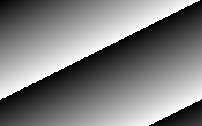
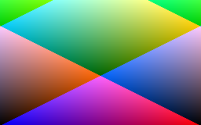

<!-- README.md is generated from README.Rmd. Please edit that file -->

```{r, include = FALSE}
suppressPackageStartupMessages({
  library(dplyr)
  library(ggplot2)
  library(foist)
})

knitr::opts_chunk$set(
  collapse = TRUE,
  comment = "#>",
  fig.path = "man/figures/README-",
  out.width = "100%",
  fig.width = 11
)
```

# FOIst - Fast Output of Images

<!-- badges: start -->


<br/>


<!-- badges: end -->


#### `foist` is a very fast way to output a matrix or array to a lossless, uncompressed image file.

<br/>

**`foist` can write lossless grey image files ~5x faster than the `png` library.**

**`foist` can write lossless RGB image files ~7x faster than the `png` library.**

**`foist` allocates a lot less memory than other methods.**

<br/>

* `foist` supports writing lossless images in 
[NETPBM](http://netpbm.sourceforge.net/),
[PNG](https://en.wikipedia.org/wiki/Portable_Network_Graphics) and
[GIF](https://en.wikipedia.org/wiki/GIF) formats.
* `foist` is fast because it uses [Rcpp](https://cran.r-project.org/package=Rcpp) 
  to quickly scale, manipulate and re-order data for image output.
* `foist` can be *wicked fast* if data-ordering is ignored. The price paid 
  for this speed is that the image will appear transposed in the output.


## What's in the box

* `write_pnm()` - NETPBM format RGB, grey and indexed colour palette images.
* `write_png()` - PNG format RGB, grey and indexed colour palette images.
* `write_gif()` - GIF format grey and indexed colour palette images.
* `vir` The 5 palettes from [viridis](https://cran.r-project.org/package=viridis).

This package would not be possible without:

* [Rcpp](https://cran.r-project.org/package=Rcpp) - The easiest way to get fast C/C++ code into R.
* [viridis](https://cran.r-project.org/package=viridis) - Wonderful palettes originally from [matplotlib](http://matplotlib.org).
* [NETPBM](http://netpbm.sourceforge.net) - A 30-year-old uncompressed image format for full-colour images.
* [PNG](https://www.w3.org/TR/PNG/) - A 20-year old image format for full-colour and indexed-colour images.
* [GIF](https://www.w3.org/Graphics/GIF/spec-gif87.txt) - A 30-year old image format for indexed-colour images.


## Technical Notes

* `foist` contains a **bespoke, minimalist PNG encoder** written in C++
    * Written so the package has complete control over the image output.
    * There is no lossless compression enabled in this PNG encoder i.e. only 
      uncompressed DEFLATE blocks are used (see [https://datatracker.ietf.org/doc/rfc1951](https://datatracker.ietf.org/doc/rfc1951) Sect 3.2.4).
    * The IDAT and ZLIB/DEFLATE blocks are output in sync (one-DEFLATE-block-per-IDAT-chunk) 
      as this made the PNG implementation much simpler.
    * The encoder uses Mark Adler's `adler32.c` code from [zlib](https://www.zlib.net/) 
      Copyright (C) 1995-2011, 2016 Mark Adler.
    * A SIMD version of `adler32()` is included but not enabled by default. 
      The speed gains weren't significant enough for the machine imcompatibility
      headaches it would introduce. 
      See `#define ADLER32_SSE` in `write-png.cpp` if you'd like to try it.
    * `crc32` implementation is a very fast slice-by-16 implementation by 
      [Stephan Brumme](https://create.stephan-brumme.com/crc32/).
      This is noticeably much faster than the slice-by-4 crc32 that comes with 
      the standard [zlib library](https://www.zlib.net/).
* `foist` contains a **bespoke, minimalist GIF encoder** written in C++
    * Written so the package has complete control over the image output.
    * Writes uncompressed GIFs only (No LZW compression is included).
    * Only 128 colours/image are possible with this GIF encoder - this limitiation
      greatly reduces the complexity of the code.
* Because PNG data also needs CRC32 and ADLER32 checksumming it is generally
  slower than GIF/PGM/PPM output.
* However, writing a matrix with a palette will be faster in GIF/PNG as it has direct support 
  for indexed colours, whereas for a NETPBM PPM file
  the intensity values need to be explicitly mapped to an RGB triplet and then
  written out in full.
* All my benchmark timings are on a machine with an SSD.

## Installation

You can install the package from [GitHub](https://github.com/coolbutuseless/foist) with:

``` r
# install.packages("remotes")
remotes::install_github("coolbutuseless/foist")
```

## Setup data

* `dbl_mat` - A 2D numeric matrix for output to a grey image. All values in range [0, 1]
* `dbl_arr` - A 3D numeric array for output to an RGB image. All values in range [0, 1]

```{r}
ncol    <- 256
nrow    <- 160
int_vec <- seq(nrow * ncol) %% 254L
int_mat <- matrix(int_vec, nrow = nrow, ncol = ncol, byrow = TRUE)
dbl_mat <- int_mat/255

# A non-boring RGB array/image
r       <- dbl_mat
g       <- matrix(rep(seq(0, 255, length.out = nrow)/255, each = ncol), nrow, ncol, byrow = TRUE)
b       <- dbl_mat[, rev(seq(ncol(dbl_mat)))  ]
dbl_arr <- array(c(r, g, b), dim = c(nrow, ncol, 3))
```


## Save a *2D matrix* as a grey image

`write_png()` and `write_pnm()` will save a 2D numeric **matrix** as a grey image.

* The matrix values must be in the range [0, 1]. 
* Use the `intensity_factor` argument to scale image values on-the-fly as they are written to file.

```{r example_pgm}
write_pnm(dbl_mat, "man/figures/col-0-n.pgm")                               # PGM
write_pnm(dbl_mat, "man/figures/col-0-i.pgm", invert = TRUE)                # PGM
write_png(dbl_mat, "man/figures/col-0-f.png", flipy = TRUE)                 # PNG
write_gif(dbl_mat, "man/figures/col-0-t.gif", convert_to_row_major = FALSE) # GIF

```

```{r echo = FALSE}
system("convert man/figures/col-0-n.pgm -define png:exclude-chunks=date,time man/figures/col-convert-0-n.png")
system("convert man/figures/col-0-i.pgm -define png:exclude-chunks=date,time man/figures/col-convert-0-i.png")
system("convert man/figures/col-0-f.pgm -define png:exclude-chunks=date,time man/figures/col-convert-0-f.png")
system("convert man/figures/col-0-t.pgm -define png:exclude-chunks=date,time man/figures/col-convert-0-t.png")
```

<div>
  
  
  
  
</div>


<div style="clear: both;">


## Save a *3D array* as an RGB image 


`write_png()` and `write_pnm()` will save a 3D numeric **array** as an RGB image.

* Array dimensions must be NxMx3 where the 3 colour planes correspond to the
  third dimension of the array.
* The matrix values must be in the range [0, 1]. 
* Use the `intensity_factor` argument to scale image values on-the-fly as they are written to file.
    

```{r example_ppm}
write_pnm(dbl_arr, filename = "man/figures/col-1-n.ppm")                                # NETPBM PPM
write_pnm(dbl_arr, filename = "man/figures/col-1-i.ppm", invert = TRUE)                 # NETPBM PPM
write_png(dbl_arr, filename = "man/figures/col-1-f.png", flipy = TRUE)                  # PNG
write_png(dbl_arr, filename = "man/figures/col-1-t.png", convert_to_row_major = FALSE)  # PNG
```

```{r echo = FALSE}
system("convert man/figures/col-1-n.ppm -define png:exclude-chunks=date,time man/figures/col-convert-1-n.png")
system("convert man/figures/col-1-i.ppm -define png:exclude-chunks=date,time man/figures/col-convert-1-i.png")
system("convert man/figures/col-1-f.ppm -define png:exclude-chunks=date,time man/figures/col-convert-1-f.png")
system("convert man/figures/col-1-t.ppm -define png:exclude-chunks=date,time man/figures/col-convert-1-t.png")
```

<div>
   
  
  
  
</div>


<div style="clear: both;">


## Save a *matrix* to an RGB image using a palette lookup


`write_png()` and `write_pnm()` will save a 2D numeric **matrix** as an RGB image if also supplied with a colour palette.

* A palette must be an integer matrix with dimensions N x 3
    * N is the number of colours in the palette
    * 2 <= N <= 256
* Values in the palette must be in the range [0, 255].
* The matrix values must initially be in the range [0, 1]. 
* Pixel values in the matrix are first scaled into the range [0, N] and 
  are then mapped to one of the RGB colours in the palette.
    


`foist` includes the 5 palettes from [viridis](https://cran.r-project.org/package=viridis) as `vir$magma` etc.

```{r example_ppm_from_matrix}
write_pnm(dbl_mat,                    "man/figures/col-0.pgm")  # NETPBM PGM
write_pnm(dbl_mat, pal = vir$magma  , "man/figures/col-3.ppm")  # NETPBM PPM
write_png(dbl_mat, pal = vir$inferno, "man/figures/col-4.png")  # PNG
write_png(dbl_mat, pal = vir$plasma , "man/figures/col-5.png")  # PNG
write_gif(dbl_mat, pal = vir$viridis, "man/figures/col-6.gif")  # GIF
write_gif(dbl_mat, pal = vir$cividis, "man/figures/col-7.gif")  # GIF
```

```{r echo = FALSE}
system("convert man/figures/col-3.ppm -define png:exclude-chunks=date,time man/figures/col-convert-3.png")
system("convert man/figures/col-4.ppm -define png:exclude-chunks=date,time man/figures/col-convert-4.png")
system("convert man/figures/col-5.ppm -define png:exclude-chunks=date,time man/figures/col-convert-5.png")
system("convert man/figures/col-6.ppm -define png:exclude-chunks=date,time man/figures/col-convert-6.png")
system("convert man/figures/col-7.ppm -define png:exclude-chunks=date,time man/figures/col-convert-7.png")
```

<div>
  
  
  
  
  
  
</div>


## Manipulate palettes

Some visual effects can be created by keeping the same data, but 
manipulating the palette of a sequence of image outputs.


```{r echo = FALSE}
tdir <- tempdir()

for (i in 2:40) {
  filename <- sprintf("pal%03i.png", i)
  filename <- file.path(tdir, filename)
  rows <- as.integer(seq.int(1, 256, length.out = i))
  pal  <- foist::vir$viridis[rows,]
  foist::write_png(dbl_mat, filename, convert_to_row_major = TRUE, pal = pal)
}


for (i in seq(40, 2)) {
  filename <- sprintf("pal%03i.png", 40 + (40 - i) + 1)
  filename <- file.path(tdir, filename)
  rows <- as.integer(seq.int(1, 256, length.out = i))
  pal  <- foist::vir$viridis[rows,]
  foist::write_png(dbl_mat, filename, convert_to_row_major = TRUE, pal = pal)
}


command <- glue::glue("convert {tdir}/pal*.png man/figures/pal-anim1.gif")
system(command)
```


```{r echo = FALSE}
tdir <- tempdir()


for (i in seq(1, 255, 5)) {
  filename <- sprintf("pal%03i.ppm", i)
  filename <- file.path(tdir, filename)
  rows <- c(seq(i, 255), seq(0, i-1))
  pal <- foist::vir$cividis[rows,]
  foist::write_pnm(dbl_mat, filename, convert_to_row_major = TRUE, pal = pal)
}


command <- glue::glue("convert  -delay 1x100 {tdir}/pal*.ppm man/figures/pal-anim2.gif")
system(command)
```


```{r echo = FALSE}
tdir <- tempdir()


for (i in seq(0, 255, 5)) {
  filename <- sprintf("crossfade-a-%03i.png", i)
  filename <- file.path(tdir, filename)
  
  pal  <- foist::vir$viridis * i/255 + foist::vir$plasma * (255 - i)/255
  mode(pal) <- 'integer'
  
  foist::write_png(dbl_mat, filename, convert_to_row_major = TRUE, pal = pal)
}


for (i in seq(0, 255, 5)) {
  filename <- sprintf("crossfade-b-%03i.png", i)
  filename <- file.path(tdir, filename)
  
  pal  <- foist::vir$plasma * i/255 + foist::vir$viridis * (255 - i)/255
  mode(pal) <- 'integer'
  
  foist::write_png(dbl_mat, filename, convert_to_row_major = TRUE, pal = pal)
}


command <- glue::glue("convert {tdir}/crossfade-*.png man/figures/pal-anim3.gif")
system(command)
```


<div>
  
  
  
</div>

<div style="clear: both;">


```{r echo = FALSE}
library(dplyr)
library(ggplot2) 

ncol    <- 1024
nrow    <- 640
int_vec <- rep.int(seq(ncol) - 1, nrow) %% 256L
int_mat <- matrix(int_vec, nrow = nrow, ncol = ncol, byrow = TRUE)
dbl_mat <- int_mat/255

r       <- dbl_mat
g       <- matrix(rep(seq(0, 255, length.out = nrow)/255, each = ncol), nrow, ncol, byrow = TRUE)
b       <- dbl_mat[, rev(seq(ncol(dbl_mat)))  ]

dbl_arr <- array(c(r, g, b), dim = c(nrow, ncol, 3))
```


## Benchmark: Saving a matrix as a grey image


The following benchmark compares the time to output of a grey image using:

* `foist::write_pnm()` in both row-major and column-major ordering
* `foist::write_png()` in both row-major and column-major ordering
* `foist::write_gif()` in both row-major and column-major ordering
* `png::writePNG()`
* `caTools::write.gif()`

As can be seen in the benchmark using `flipy = TRUE` or `invert = TRUE` have almost 
no speed penalty.


```{r echo = FALSE, warning=FALSE}
tmp <- tempfile()

res <- bench::mark(
  `foist::write_pnm()`                          = foist::write_pnm(dbl_mat, tmp),
  `foist::write_pnm(column-major)`              = foist::write_pnm(dbl_mat, tmp, convert_to_row_major = FALSE),
  
  `foist::write_gif()`                          = foist::write_gif(dbl_mat, tmp),
  `foist::write_gif(column-major)`              = foist::write_gif(dbl_mat, tmp, convert_to_row_major = FALSE),
  
  `foist::write_png()`                          = foist::write_png(dbl_mat, tmp),
  `foist::write_png(column-major)`              = foist::write_png(dbl_mat, tmp, convert_to_row_major = FALSE),
  `foist::write_png(column-major:flipy:invert)` = foist::write_png(dbl_mat, tmp, convert_to_row_major = FALSE, flipy = TRUE, invert = TRUE),
  
  `png::writePNG()`                             = png::writePNG   (dbl_mat, tmp),
  
  `caTools::write.gif()`                        = caTools::write.gif(dbl_mat, tmp),
  
  min_time = 2, check = FALSE
)
```


```{r benchmark_grey, echo = FALSE}
res %>%
  select(expression, min, median, `itr/sec`, mem_alloc) %>%
  mutate(`itr/sec` = round(`itr/sec`)) %>%
  knitr::kable(caption = "Benchmark results")

plot(res) + 
  theme_bw(15) + 
  theme(legend.position = 'bottom') + 
  labs(title = 'Saving a 1024x640 grey image', y = '') 
```


## Benchmark: Saving an RGB image

The following benchmark compares the time to output a colour image using:


* `foist::write_pnm()` saving a 3D array in both row-major and column-major ordering
* `foist::write_png()` saving a 3D array in both row-major and column-major ordering
* `foist::write_png()` saving a 2D matrix with an indexed colour palette
* `foist::write_gif()` saving a 2D matrix with an indexed colour palette
* `png::writePNG()` saving a 3D array


```{r echo = FALSE}
tmp <- tempfile()

res <- bench::mark(
  `foist::write_pnm()`                    = foist::write_pnm(dbl_arr, tmp),
  `foist::write_pnm(column-major)`        = foist::write_pnm(dbl_arr, tmp, convert_to_row_major = FALSE),
  
  `foist::write_png()`                    = foist::write_png(dbl_arr, tmp),
  `foist::write_png(column-major)`        = foist::write_png(dbl_arr, tmp, convert_to_row_major = FALSE),
  
  `foist::write_png(indexed colour)`      = foist::write_png(dbl_mat, tmp, convert_to_row_major = FALSE, pal = foist::vir$magma),
  `foist::write_gif(indexed colour)`      = foist::write_gif(dbl_mat, tmp, convert_to_row_major = FALSE, pal = foist::vir$magma),
  
  `png::writePNG()`                       = png::writePNG   (dbl_arr, tmp),
  min_time = 2, check = FALSE
)
```


```{r benchmark_rgb, echo = FALSE}
res %>%
  select(expression, min, median, `itr/sec`, mem_alloc) %>%
  mutate(`itr/sec` = round(`itr/sec`)) %>%
  knitr::kable(caption = "Benchmark results")

plot(res) + 
  theme_bw(15) + 
  theme(legend.position = 'bottom') + 
  labs(title = 'Saving a 1024x640 RGB image', y = '')
```


## Benchmark: Saving an RGB image vs JPEG

The following benchmark compares the time to output a colour image using:


* `foist::write_png()` saving a 3D array in both row-major and column-major ordering


```{r echo = FALSE}
tmp <- tempfile()

res <- bench::mark(
  `foist::write_png()`                    = foist::write_png(dbl_arr, tmp),
  `foist::write_png(column-major)`        = foist::write_png(dbl_arr, tmp, convert_to_row_major = FALSE),
  
  `jpeg::writeJPEG()`                     = jpeg::writeJPEG(dbl_arr, tmp),
  min_time = 2, check = FALSE
)
```


```{r benchmark_rgb_jpeg, echo = FALSE}
res %>%
  select(expression, min, median, `itr/sec`, mem_alloc) %>%
  mutate(`itr/sec` = round(`itr/sec`)) %>%
  knitr::kable(caption = "Benchmark results")

plot(res) + 
  theme_bw(15) + 
  theme(legend.position = 'bottom') + 
  labs(title = 'Saving a 1024x640 RGB image', y = '')
```


