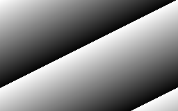
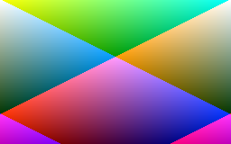
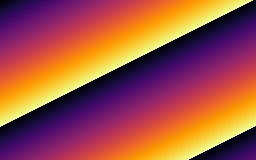

<!-- README.md is generated from README.Rmd. Please edit that file -->

# FOIst - Fast Output of Images

<!-- badges: start -->


<!-- badges: end -->

#### `foist` is a very fast way to output a matrix or array to a lossless image file.

<br/>

**`foist` can write lossless grey image files \~5x faster than the `png`
library.**

**`foist` can write lossless RGB image files \~7x faster than the `png`
library.**

**`foist` allocates a lot less memory than other methods.**

<br/>

  - Supports writing lossless images in two formats:
      - [NETPBM](http://netpbm.sourceforge.net/) PGM (grey) and PPM
        (RGB) files
      - [PNG](https://en.wikipedia.org/wiki/Portable_Network_Graphics)
        files - Grey, RGB or with an explicit colour palette.
  - Only supports 8-bits-per-channel grey and RGB images.
  - Part of the speed of `foist` comes from using
    [Rcpp](https://cran.r-project.org/package=Rcpp) to quickly scale,
    manipulate and re-order data for image output. Because of this, the
    following operations are almost free (in terms of execution time):
      - flipping the image veritcally - `flipy = TRUE`
      - inverting the intensity - `invert = TRUE`
  - The fastest output speed is achieved by writing the data in the same
    order in which it is stored in R (column major ordering). The price
    paid for this speed is that the image will appear transposed in the
    output.

## What’s in the box

  - `write_pnm()` and `write_png()` which can both:
      - write an array to an RGB image
      - write a matrix to a grey image
      - write a matrix to a RGB image with a supplied palette
  - `vir` 5 palettes from
    [viridis](https://cran.r-project.org/package=viridis) in the
    appropriate format

This package would not be possible without:

  - [Rcpp](https://cran.r-project.org/package=Rcpp) - The easiest way to
    get fast C/C++ code into R.
  - [viridis](https://cran.r-project.org/package=viridis) - Wonderful
    palettes originally from [matplotlib](http://matplotlib.org).
  - [NETPBM](http://netpbm.sourceforge.net) - A 30-year-old, rock-solid,
    uncompressed image format.
  - [PNG](https://www.w3.org/TR/PNG/) - A 20-year old, rock-solid image
    format with lossless compression (which also supports uncompressed
    image data).

## Caveats

Don’t look at my C/C++ code unless you’d like a heart attack.

## Technical Notes

  - `foist` contains a bespoke, minimalist PNG encoder I wrote in C++
      - This was written so I’d have complete control over the image
        output.
      - There is no lossless compression enabled in this PNG encoder
        i.e. only uncompressed DEFLATE blocks are used (see
        <https://datatracker.ietf.org/doc/rfc1951> Sect 3.2.4).
      - The IDAT and ZLIB/DEFLATE blocks are output in sync
        (one-DEFLATE-block-per-IDAT-chunk) as this made the PNG
        implementation much simpler.
      - The encoder uses Mark Adler’s `adler32.c` code from
        [zlib](https://www.zlib.net/) Copyright (C) 1995-2011, 2016 Mark
        Adler.
      - A SIMD version of `adler32()` is included but not enabled by
        default. The speed gains weren’t significant enough for the
        machine imcompatibility headaches it would introduce. See
        `#define ADLER32_SSE` in `write-png.cpp` if you’d like to try
        it.
      - `crc32` implementation is a very fast slice-by-16 implementation
        by [Stephan Brumme](https://create.stephan-brumme.com/crc32/).
        This is noticeably much faster than the slice-by-4 crc32 that
        comes with the standard [zlib library](https://www.zlib.net/).
  - Because PNG data also needs CRC32 and ADLER32 checksumming it is
    generally slower than PGM/PPM output.
  - However, writing a matrix with a palette will be faster in PNG as it
    has direct support for indexed colours, whereas for a NETPBM PPM
    file the intensity values need to be explicitly mapped to an RGB
    triplet and then written out in full.

## Installation

You can install the package from
[GitHub](https://github.com/coolbutuseless/foist) with:

``` r
# install.packages("devtools")
devtools::install_github("coolbutuseless/foist")
```

## Setup data

  - `dbl_mat` - A 2D numeric matrix for output to a grey image. All
    values in range \[0, 1\]
  - `dbl_arr` - A 3D numeric array for output to an RGB image. All
    values in range \[0, 1\]

<!-- end list -->

``` r
ncol    <- 256
nrow    <- 160
int_vec <- seq(nrow * ncol) %% 254L
int_mat <- matrix(int_vec, nrow = nrow, ncol = ncol, byrow = TRUE)
dbl_mat <- int_mat/255

# A non-boring RGB array/image
r       <- dbl_mat
g       <- matrix(rep(seq(0, 255, length.out = nrow)/255, each = ncol), nrow, ncol, byrow = TRUE)
b       <- dbl_mat[, rev(seq(ncol(dbl_mat)))  ]
dbl_arr <- array(c(r, g, b), dim = c(nrow, ncol, 3))
```

## Save a *2D matrix* as a grey image

`write_png()` and `write_pnm()` will save a 2D numeric **matrix** as a
grey image.

  - The matrix values must be in the range \[0, 1\].
  - Use the `intensity_factor` argument to scale image values on-the-fly
    as they are written to file.

<!-- end list -->

``` r
# NETPBM PGM
write_pnm(dbl_mat, "man/figures/col-0-n.pgm")
write_pnm(dbl_mat, "man/figures/col-0-i.pgm", invert = TRUE)
write_pnm(dbl_mat, "man/figures/col-0-f.pgm", flipy = TRUE)
write_pnm(dbl_mat, "man/figures/col-0-t.pgm", convert_to_row_major = FALSE)

# PNG
write_png(dbl_mat, "man/figures/col-0-n.png")
write_png(dbl_mat, "man/figures/col-0-i.png", invert = TRUE)
write_png(dbl_mat, "man/figures/col-0-f.png", flipy = TRUE)
write_png(dbl_mat, "man/figures/col-0-t.png", convert_to_row_major = FALSE)
```

<div>





</div>

<div>

<div style="float:left; width:25%; margin-left: 1%;">

Default

</div>

<div style="float:left; width:25%; margin-left: 1%;">

Invert Colour

</div>

<div style="float:left; width:25%; margin-left: 1%;">

Flip Y

</div>

<div style="float:left; width:16%; margin-left: 1%;">

Output as column-major

</div>

</div>

<div style="clear: both;">

## Save a *3D array* as an RGB image

`write_png()` and `write_pnm()` will save a 3D numeric **array** as an
RGB image.

  - Array dimensions must be NxMx3 where the 3 colour planes correspond
    to the third dimension of the array.
  - The matrix values must be in the range \[0, 1\].
  - Use the `intensity_factor` argument to scale image values on-the-fly
    as they are written to file.

<!-- end list -->

``` r
# NETPBM PPM format
write_pnm(dbl_arr, filename = "man/figures/col-1-n.ppm")
write_pnm(dbl_arr, filename = "man/figures/col-1-i.ppm", invert = TRUE)
write_pnm(dbl_arr, filename = "man/figures/col-1-f.ppm", flipy = TRUE)
write_pnm(dbl_arr, filename = "man/figures/col-1-t.ppm", convert_to_row_major = FALSE)

# PNG
write_png(dbl_arr, filename = "man/figures/col-1-n.png")
write_png(dbl_arr, filename = "man/figures/col-1-i.png", invert = TRUE)
write_png(dbl_arr, filename = "man/figures/col-1-f.png", flipy = TRUE)
write_png(dbl_arr, filename = "man/figures/col-1-t.png", convert_to_row_major = FALSE)
```

<div>





</div>

<div>

<div style="float:left; width:25%; margin-left: 1%;">

Default

</div>

<div style="float:left; width:25%; margin-left: 1%;">

Invert Colour

</div>

<div style="float:left; width:25%; margin-left: 1%;">

Flip Y

</div>

<div style="float:left; width:16%; margin-left: 1%;">

Output as column-major

</div>

</div>

<div style="clear: both;">


## Save a *matrix* to an RGB image using a palette lookup

`write_png()` and `write_pnm()` will save a 2D numeric **matrix** as an
RGB image if also supplied with a colour palette.

  - A palette must be an integer matrix with dimensions N x 3
      - N is the number of colours in the palette
      - 2 \<= N \<= 256
  - Values in the palette must be in the range \[0, 255\].
  - The matrix values must initially be in the range \[0, 1\].
  - Pixel values in the matrix are first scaled into the range \[0, N\]
    and are then mapped to one of the RGB colours in the palette.

`foist` includes the 5 palettes from
[viridis](https://cran.r-project.org/package=viridis) as `vir$magma`
etc.

``` r
# NETPBM format
foist::write_pnm(dbl_mat,                           "man/figures/col-0.pgm")
foist::write_pnm(dbl_mat, pal = foist::vir$magma  , "man/figures/col-3.ppm")
foist::write_pnm(dbl_mat, pal = foist::vir$inferno, "man/figures/col-4.ppm")
foist::write_pnm(dbl_mat, pal = foist::vir$plasma , "man/figures/col-5.ppm")
foist::write_pnm(dbl_mat, pal = foist::vir$viridis, "man/figures/col-6.ppm")
foist::write_pnm(dbl_mat, pal = foist::vir$cividis, "man/figures/col-7.ppm")

# PNG format
foist::write_png(dbl_mat,                           "man/figures/col-0.png")
foist::write_png(dbl_mat, pal = foist::vir$magma  , "man/figures/col-3.png")
foist::write_png(dbl_mat, pal = foist::vir$inferno, "man/figures/col-4.png")
foist::write_png(dbl_mat, pal = foist::vir$plasma , "man/figures/col-5.png")
foist::write_png(dbl_mat, pal = foist::vir$viridis, "man/figures/col-6.png")
foist::write_png(dbl_mat, pal = foist::vir$cividis, "man/figures/col-7.png")
```

<div>





</div>

## Manipulate palettes

Some visual effects can be created by keeping the same data, but
manipulating the palette of a sequence of image outputs.

<div>

<div style="float:left; width:30%; margin-left: 10px;">

Reduce colours

</div>

<div style="float:left; width:30%; margin-left: 10px;">

Rotate palette

</div>

<div style="float:left; width:30%; margin-left: 10px;">

Cross-fade between
palettes

</div>

</div>

<div>


</div>

## Benchmark: Saving a matrix as a grey image

The following benchmark compares the time to output of a grey image
using:

  - `foist::write_pnm()` in both row-major and column-major ordering
  - `foist::write_png()` in both row-major and column-major ordering
  - `png::writePNG()`

<!-- end list -->

``` r
tmp <- tempfile()

res <- bench::mark(
  `foist::write_pnm()`                    = foist::write_pnm(dbl_mat, tmp),
  `foist::write_pnm(column-major)`        = foist::write_pnm(dbl_mat, tmp, convert_to_row_major = FALSE),
  
  `foist::write_png()`                    = foist::write_png(dbl_mat, tmp),
  `foist::write_png(column-major)`        = foist::write_png(dbl_mat, tmp, convert_to_row_major = FALSE),
  
  `png::writePNG()`                       = png::writePNG   (dbl_mat, tmp),
  min_time = 2, check = FALSE
)
```

| expression                      |     min |   mean |  median | itr/sec | mem\_alloc |
| :------------------------------ | ------: | -----: | ------: | ------: | ---------: |
| foist::write\_pnm()             |  3.16ms | 4.31ms |  4.13ms |     232 |     2.49KB |
| foist::write\_pnm(column-major) |   2.2ms | 2.77ms |  2.54ms |     361 |     2.49KB |
| foist::write\_png()             |  3.54ms | 4.39ms |  4.03ms |     228 |     2.49KB |
| foist::write\_png(column-major) |   2.3ms | 3.06ms |  2.84ms |     327 |     2.49KB |
| png::writePNG()                 | 12.36ms | 14.3ms | 14.27ms |      70 |   673.21KB |

Benchmark results


## Benchmark: Saving an array as an RGB image

The following benchmark compares the time to output a colour image
using:

  - `foist::write_pnm()` in both row-major and column-major ordering
  - `foist::write_png()` in both row-major and column-major ordering
  - `png::writePNG()`

<!-- end list -->

``` r
tmp <- tempfile()

res <- bench::mark(
  `foist::write_pnm()`                    = foist::write_pnm(dbl_arr, tmp),
  `foist::write_pnm(column-major)`        = foist::write_pnm(dbl_arr, tmp, convert_to_row_major = FALSE),
  
  `foist::write_png()`                    = foist::write_png(dbl_arr, tmp),
  `foist::write_png(column-major)`        = foist::write_png(dbl_arr, tmp, convert_to_row_major = FALSE),
  
  `foist::write_png(indexed colour)`      = foist::write_png(dbl_mat, tmp, convert_to_row_major = FALSE, pal = foist::vir$magma),
  
  `png::writePNG()`                       = png::writePNG   (dbl_arr, tmp),
  min_time = 2, check = FALSE
)
```

| expression                        |     min |    mean |  median | itr/sec | mem\_alloc |
| :-------------------------------- | ------: | ------: | ------: | ------: | ---------: |
| foist::write\_pnm()               | 18.83ms | 21.91ms | 21.09ms |      46 |     2.49KB |
| foist::write\_pnm(column-major)   |  5.01ms |   6.4ms |  6.03ms |     156 |     2.49KB |
| foist::write\_png()               | 19.68ms | 21.75ms | 21.53ms |      46 |     2.49KB |
| foist::write\_png(column-major)   |  6.34ms |  7.64ms |  7.24ms |     131 |     2.49KB |
| foist::write\_png(indexed colour) |  2.37ms |  2.91ms |  2.77ms |     344 |     2.49KB |
| png::writePNG()                   | 44.39ms | 48.66ms | 48.64ms |      21 |     1.88MB |

Benchmark results


