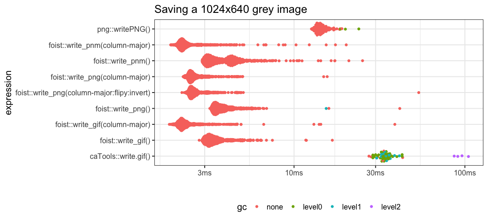
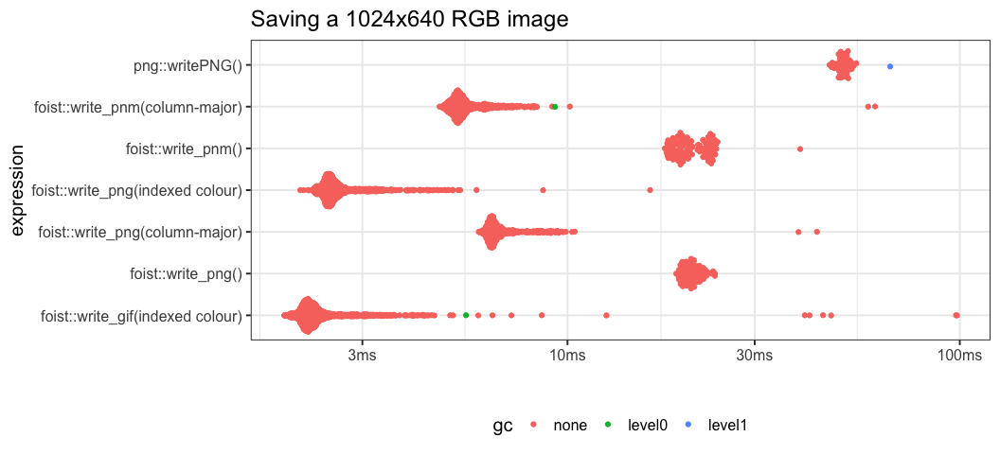

<!-- README.md is generated from README.Rmd. Please edit that file -->

# FOIst - Fast Output of Images

<!-- badges: start -->


<!-- badges: end -->

#### `foist` is a very fast way to output a matrix or array to a lossless image file.

**`foist` writes lossless grey image files \~5.5x faster than the `png`
library.**

**`foist` writes lossless RGB image files \~7.5x faster than the `png`
library**

**`foist` allocates 300-1000x *less* memory than png.**

  - Only supports writing (lossless)
    [NETPBM](http://netpbm.sourceforge.net/) PGM (grey) and PPM (RGB)
    files
  - Only supports 8-bits-per-channel grey and RGB images.
  - Uses [Rcpp](https://cran.r-project.org/package=Rcpp) to do
      - **type conversion** from *double* to *unsigned byte*, and
      - **data re-ordering** from R’s column-major ordering to image
        output with row-major ordering
  - By specifying `convert_to_row_major = FALSE` the image data-ordering
    is not converted from R’s native data ordering - this makes image
    saving very fast as data manipulation operations are minimised and
    cache coherency is much improved. However, the image will appear
    tranposed in the output.

## What’s in the box

  - `write_pgm()` - write a matrix to a grey image
  - `write_ppm()` - write an array to an RGB image
  - `write_pal_ppm()` write a matrix to an RGB image using a supplied
    palette
  - `vir` 5 palettes from
    [viridis](https://cran.r-project.org/package=viridis) in the
    appropriate format

This package would not be possible without:

  - [Rcpp](https://cran.r-project.org/package=Rcpp) - The easiest way to
    get fast C/C++ code into R
  - [viridis](https://cran.r-project.org/package=viridis) - The
    wonderful palettes originally from
    [matplotlib](http://matplotlib.org)
  - [NETPBM](http://netpbm.sourceforge.net) - A 30-year-old, rock-solid,
    uncompressed image format

## Caveats

Don’t look at my C code unless you’d like a heart attack - or perhaps to
lend a hand\!

## Installation

You can install the development version from
[GitHub](https://github.com/coolbutuseless/foist) with:

``` r
# install.packages("devtools")
devtools::install_github("coolbutuseless/foist")
```

## Setup data

  - `dbl_mat` - A numeric matrix to output to a grey image. All values
    in range \[0, 1\]
  - `dbl_arr` - A 3d numeric array to output to an RGB image. All values
    in range \[0, 1\]

<!-- end list -->

``` r
ncol    <- 256
nrow    <- 160
int_vec <- seq(nrow * ncol) %% 254L
int_mat <- matrix(int_vec, nrow = nrow, ncol = ncol, byrow = TRUE)
dbl_mat <- int_mat/255

# A non-boring RGB array/image
r       <- dbl_mat
g       <- matrix(rep(seq(0, 255, length.out = nrow)/255, each = ncol), nrow, ncol, byrow = TRUE)
b       <- dbl_mat[, rev(seq(ncol(dbl_mat)))  ]
dbl_arr <- array(c(r, g, b), dim = c(nrow, ncol, 3))
```

## Save a *2D matrix* as a grey image

A 2D numeric **matrix** can be saved as a grey image using
`write_pgm()`.

The matrix values must be in the range \[0, 1\]. Use the
`intensity_factor` argument to scale image values on-the-fly as they are
written to file.

``` r
write_pgm(dbl_mat, "man/figures/col-0-n.pgm")
write_pgm(dbl_mat, "man/figures/col-0-f.pgm", flipy = TRUE)
write_pgm(dbl_mat, "man/figures/col-0-t.pgm", convert_to_row_major = FALSE)
```

<div>


</div>

## Save a *3D array* as an RGB image

An NxMx3 **array** can be saved as an RGB image. Each of the colours is
represented of one of the 3 planes of the array.

The array values must be in the range \[0, 1\]. Use the
`intensity_factor` argument to scale image values on-the-fly as they are
written to file.

``` r
write_ppm(dbl_arr, filename = "man/figures/col-1-n.ppm")
write_ppm(dbl_arr, filename = "man/figures/col-1-f.ppm", flipy = TRUE)
write_ppm(dbl_arr, filename = "man/figures/col-1-t.ppm", convert_to_row_major = FALSE)
```

<div>


</div>

## Save a *matrix* to an RGB image using a palette lookup

Using `write_pal_ppm()`, `foist` can write a grey image as an RGB image
by using each grey pixel value to lookup an RGB colour in a given
palette.

A palette must be an integer matrix with dimensions 256 x 3 and values
in the range \[0, 255\].

The matrix values must be in the range \[0, 1\]. Use the
`intensity_factor` argument to scale image values on-the-fly as they are
written to file.

`foist` includes the 5 palettes from
[viridis](https://cran.r-project.org/package=viridis) as `vir$magma`
etc.

``` r
foist::write_pgm    (dbl_mat,                           "man/figures/col-0.pgm")
foist::write_pal_ppm(dbl_mat, pal = foist::vir$magma  , "man/figures/col-3.ppm")
foist::write_pal_ppm(dbl_mat, pal = foist::vir$inferno, "man/figures/col-4.ppm")
foist::write_pal_ppm(dbl_mat, pal = foist::vir$plasma , "man/figures/col-5.ppm")
foist::write_pal_ppm(dbl_mat, pal = foist::vir$viridis, "man/figures/col-6.ppm")
foist::write_pal_ppm(dbl_mat, pal = foist::vir$cividis, "man/figures/col-7.ppm")
```

<div>


</div>

## Benchmark: Saving a matrix as a grey image

The following benchmark compares:

  - `foist::write_pgm()` in both row-major and column-major ordering
      - by **not** converting to row-major ordering the data is written
        in the same order it is stored in R. By minimizing this data
        manipulation some significant speedups are achieved.
  - `png::writePNG()`
  - `jpeg::writeJPEG()` - I’m not actually interested in lossy output,
    but it is interesting to note just how fast the jpeg library is.

<!-- end list -->

``` r
tmp <- tempfile()

res <- bench::mark(
  `foist::write_pgm()`                    = foist::write_pgm(dbl_mat, tmp),
  `foist::write_pgm(column-major)`        = foist::write_pgm(dbl_mat, tmp, convert_to_row_major = FALSE),
  `foist::write_pgm(column-major, flipy)` = foist::write_pgm(dbl_mat, tmp, convert_to_row_major = FALSE, flipy = TRUE),
  `png::writePNG()`                       = png::writePNG   (dbl_mat, tmp),
  `jpeg::writeJPEG`                       = jpeg::writeJPEG (dbl_mat, tmp),
  min_time = 2, check = FALSE
)
```

| expression                             |     min |    mean |  median | itr/sec | mem\_alloc |
| :------------------------------------- | ------: | ------: | ------: | ------: | ---------: |
| foist::write\_pgm()                    |  2.97ms |  4.29ms |  4.11ms |     233 |     2.49KB |
| foist::write\_pgm(column-major)        |  2.04ms |  2.45ms |   2.3ms |     408 |     2.49KB |
| foist::write\_pgm(column-major, flipy) |  2.05ms |  2.46ms |  2.32ms |     407 |     2.49KB |
| png::writePNG()                        | 11.88ms | 14.27ms | 13.78ms |      70 |   673.21KB |
| jpeg::writeJPEG                        |  6.06ms |  7.74ms |  7.62ms |     129 |   663.55KB |

Benchmark results



## Benchmark: Saving an array as an RGB image

The following benchmark compares:

  - `foist::write_ppm()` in both row-major and column-major ordering
      - by **not** converting to row-major ordering the data is written
        in the same order it is stored in R. By minimizing this data
        manipulation some significant speedups are achieved.
  - `png::writePNG()`
  - `jpeg::writeJPEG()` - I’m not actually interested in lossy output,
    but it is interesting to note just how fast the jpeg library is.

<!-- end list -->

``` r
tmp <- tempfile()

res <- bench::mark(
  `foist::write_ppm()`                    = foist::write_ppm(dbl_arr, tmp),
  `foist::write_ppm(column-major)`        = foist::write_ppm(dbl_arr, tmp, convert_to_row_major = FALSE),
  `foist::write_ppm(column-major, flipy)` = foist::write_ppm(dbl_arr, tmp, convert_to_row_major = FALSE, flipy = TRUE),
  `png::writePNG()`                       = png::writePNG   (dbl_arr, tmp),
  `jpeg::writeJPEG`                       = jpeg::writeJPEG (dbl_arr, tmp),
  min_time = 2, check = FALSE
)
```

| expression                             |     min |    mean |  median | itr/sec | mem\_alloc |
| :------------------------------------- | ------: | ------: | ------: | ------: | ---------: |
| foist::write\_ppm()                    | 18.19ms | 21.48ms | 21.45ms |      47 |     2.49KB |
| foist::write\_ppm(column-major)        |  4.67ms |   5.9ms |  5.59ms |     170 |     2.49KB |
| foist::write\_ppm(column-major, flipy) |  4.66ms |  5.97ms |   5.6ms |     168 |     2.49KB |
| png::writePNG()                        | 44.73ms | 48.52ms | 48.69ms |      21 |     1.88MB |
| jpeg::writeJPEG                        | 26.04ms |  28.1ms |  28.1ms |      36 |     1.88MB |

Benchmark results


